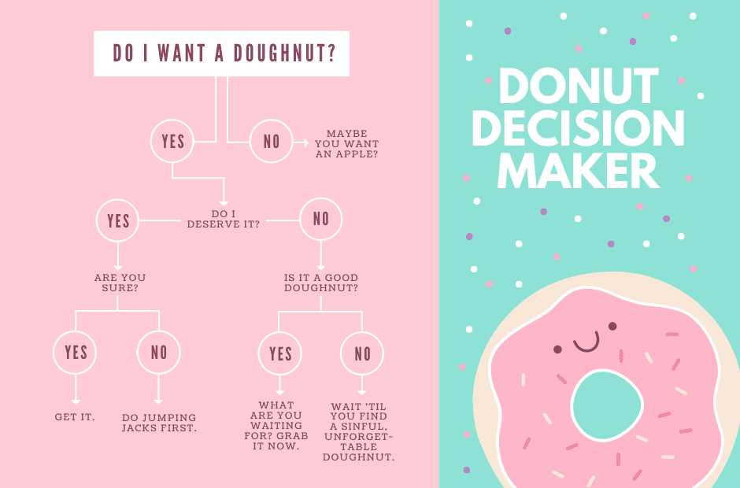

## SIRL
Simple infomation relation language

SIRL is a simple syntax for describing relationships between strings. Much like a decision diagram or flow chart.

SIRL takes files in the format

```
# Root node
(ROOT | Root Node)			    => child1, child2, child3

# Children
(child1 | This is child 1)		=> terminal
(child2 | This is child 2)		=> terminal
(child3 | This is child 3)		=> terminal

# Terminal
(terminal | This is a terminal)		=> END
```

and outputs a dictionary with the command `make_flow(read_chart("file_name.txt"))`

```python
{
    "Root Node": [
        {"This is child 1": ["This is a terminal"]},
        {"This is child 2": ["This is a terminal"]},
        {"This is child 3": ["This is a terminal"]},
    ]
}
```

---
## Example: Do I deserve a donut?
We'll convert a decision chart into our format, and pass it through `decision.py`, found in assets, to create a little interactive diagram.

*Credit: canva.com*

In SIRL, that diagram looks like
```
# ROOT
(ROOT | Do I want a doughnut?)		=> yes_want, no_want

# Yes/No want donut
(yes_want | Yes)			=> deserve?
(no_want  | No)				=> T_maybe_apple

# Do i deserve it?
(deserve?    | Do I deserve it?)	=> yes_deserve, no_deserve
(yes_deserve | Yes)			=> sure?
(no_deserve  | No)			=> is_it_good?

# Are you sure you deserve the donut?
(sure?    | Are you sure?)		=> yes_sure, no_sure
(yes_sure | Yes)			=> T_get_it
(no_sure  | No)				=> T_jumping_jacks

# Is the donut good?
(is_it_good? | Is it a good donut)	=> yes_good, no_good
(yes_good    | Yes)			=> T_grab_now
(no_good     | No)			=> T_wait

# Terminals
(T_maybe_apple   | Maybe you want an apple?)	     => END 
(T_get_it        | Get it)                           => END 
(T_jumping_jacks | Do jumping jacks first)           => END
(T_grab_now      | Don't wait! Grab it!)             => END
(T_wait          | Wait until you find a better one) => END
```

Throwing this file into `make_flow(read_chart())` and taking the resulting dict and executing `decision/do_paths` with it, we get:
```
Do I want a doughnut?
        Yes
        No
> Yes
Do I deserve it?
        Yes
        No
> No
Is it a good donut
        Yes
        No
> Yes
Don't wait! Grab it!
```

As well as the other respective paths
